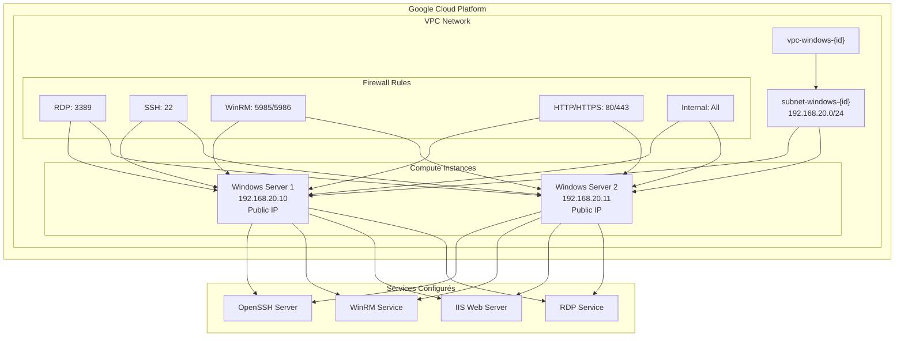

# Windows Server Administration - Infrastructure Terraform

[](https://terraform.io)
[](https://cloud.google.com)
[](https://www.microsoft.com/windows-server)

## 📋 Vue d'ensemble

Ce projet Terraform déploie une infrastructure Windows Server sur Google Cloud Platform avec deux serveurs Windows Server 2025 configurés pour l'administration à distance. L'infrastructure inclut un réseau VPC dédié, des règles de pare-feu pour RDP, SSH, WinRM et HTTP/HTTPS, ainsi que des scripts de démarrage PowerShell pour la configuration automatique des serveurs.

## 🏗️ Architecture



## 🎓 Guide pour débutants

### 📋 Préparation de l'environnement GCP

#### 1. Créer un compte Google Cloud Platform

1. **Aller sur** [Google Cloud Console](https://console.cloud.google.com/)
2. **Se connecter** avec n'importe quelle adresse email Google
3. **Accepter** les conditions d'utilisation
4. **Créer un nouveau projet** ou utiliser le projet par défaut

#### 2. Activer les crédits gratuits

1. **Aller dans** "Facturation" dans la console GCP
2. **Activer la facturation** (nécessaire même pour les crédits gratuits)
3. **Utiliser les crédits gratuits** : Google offre $300 de crédits pour 90 jours
4. **Vérifier les quotas** : Les crédits gratuits couvrent largement ce projet

#### 3. Créer un compte de service

1. **Aller dans** "IAM et administration" > "Comptes de service"
2. **Créer un compte de service** :
   - Nom : `terraform-admin`
   - Description : `Compte de service pour Terraform`
3. **Attribuer les rôles** :
   - `Propriétaire` (ou `Éditeur` + `Compute Admin`)
   - `Service Account User`
4. **Créer une clé JSON** :
   - Cliquer sur le compte de service
   - Onglet "Clés" > "Ajouter une clé" > "Créer une nouvelle clé"
   - Type : JSON
   - **Télécharger** le fichier JSON

#### 4. Configurer l'authentification

1. **Renommer** le fichier téléchargé en `key.json`
2. **Placer** le fichier à la racine du projet :
   ```
   windows_server_administration/
   ├── key.json          ← Votre fichier de clés
   ├── README.md
   └── terraform/
   ```

### 💻 Préparation de l'environnement local

#### Option 1 : Machine Linux (Recommandée)

1. **Installer une VM Linux** :
   - Ubuntu 20.04+ ou CentOS 8+
   - 2 vCPU, 4GB RAM minimum
   - Accès SSH activé

2. **Se connecter en SSH** :
   ```bash
   ssh utilisateur@ip-de-votre-vm
   ```

3. **Installer Terraform** :
   ```bash
   # Ubuntu/Debian
   wget -O- https://apt.releases.hashicorp.com/gpg | gpg --dearmor | sudo tee /usr/share/keyrings/hashicorp-archive-keyring.gpg
   echo "deb [signed-by=/usr/share/keyrings/hashicorp-archive-keyring.gpg] https://apt.releases.hashicorp.com $(lsb_release -cs) main" | sudo tee /etc/apt/sources.list.d/hashicorp.list
   sudo apt update && sudo apt install terraform
   
   # Vérifier l'installation
   terraform version
   ```

#### Option 2 : Windows avec WSL2

1. **Installer WSL2** :
   ```powershell
   wsl --install
   ```

2. **Installer Terraform dans WSL** :
   ```bash
   # Dans WSL Ubuntu
   sudo apt update
   sudo apt install terraform
   ```

#### Option 3 : Cloud Shell (Google Cloud)

1. **Ouvrir Cloud Shell** dans la console GCP
2. **Terraform est pré-installé** dans Cloud Shell
3. **Uploader** le fichier `key.json` via l'interface

### 🚀 Déploiement du projet

#### 1. Cloner le projet

```bash
# Cloner le repository
git clone <repository-url>
cd windows_server_administration

# Vérifier la structure
ls -la
# Vous devriez voir : key.json, README.md, terraform/
```

#### 2. Configurer Terraform

```bash
# Aller dans le dossier terraform
cd terraform

# Initialiser Terraform
terraform init

# Vérifier la configuration
terraform validate
```

#### 3. Planifier le déploiement

```bash
# Voir ce qui va être créé
terraform plan

# Le plan doit montrer :
# - 1 VPC network
# - 1 subnet
# - 5 firewall rules
# - 2 public IPs
# - 2 Windows Server instances
```

#### 4. Déployer l'infrastructure

```bash
# Déployer (confirmer avec 'yes')
terraform apply

# Ou déploiement automatique
terraform apply -auto-approve
```

#### 5. Récupérer les informations de connexion

```bash
# Voir toutes les informations
terraform output

# Informations de connexion SSH
terraform output ssh_connection_info

# Informations de connexion RDP
terraform output rdp_connection_info

# Mots de passe
terraform output server1_password
terraform output server2_password
```

### 🔗 Connexion aux serveurs

#### Connexion SSH (Linux/Mac)

```bash
# Récupérer l'IP du serveur 1
SERVER1_IP=$(terraform output -raw server1_public_ip)
echo "IP du serveur 1 : $SERVER1_IP"

# Se connecter
ssh admin@$SERVER1_IP
# Mot de passe : WinSrv1-XXXX (voir terraform output server1_password)
```

#### Connexion RDP (Windows)

```bash
# Récupérer l'IP
SERVER1_IP=$(terraform output -raw server1_public_ip)

# Commande RDP
mstsc /v:$SERVER1_IP
# Utilisateur : admin
# Mot de passe : WinSrv1-XXXX
```

### 🧹 Nettoyage (Important !)

```bash
# Détruire l'infrastructure pour éviter les coûts
terraform destroy

# Confirmer avec 'yes'
# Cela supprime tous les serveurs et libère les ressources
```

### 🚨 Dépannage rapide

#### Erreur : "Fichier key.json non trouvé"
```bash
# Vérifier que le fichier existe
ls -la key.json

# Le fichier doit être à la racine du projet
# windows_server_administration/key.json
```

#### Erreur : "Quota dépassé"
```bash
# Vérifier les quotas dans la console GCP
# IAM et administration > Quotas
# Ou demander une augmentation
```

#### Erreur : "API non activée"
```bash
# Activer l'API Compute Engine
# Console GCP > APIs et services > Bibliothèque
# Rechercher "Compute Engine API" et l'activer
```

#### Erreur : "Permission refusée"
```bash
# Vérifier les rôles du compte de service
# Console GCP > IAM et administration > Comptes de service
# Le compte doit avoir le rôle "Propriétaire" ou "Éditeur"
```

#### Les serveurs ne répondent pas
```bash
# Attendre 5-10 minutes après le déploiement
# Les scripts PowerShell prennent du temps à s'exécuter

# Vérifier les logs de démarrage
gcloud compute instances get-serial-port-output windows-server-1 --zone=us-central1-a
```

## 🚀 Démarrage rapide (Utilisateurs expérimentés)

### Pré-requis

- [Terraform](https://terraform.io/downloads) >= 1.0
- [Google Cloud CLI](https://cloud.google.com/sdk/docs/install)
- Fichier de clés de service GCP (`key.json`)

### Installation

```bash
# 1. Cloner le projet
git clone <repository-url>
cd windows_server_administration

# 2. Initialiser Terraform
cd terraform
terraform init

# 3. Planifier le déploiement
terraform plan

# 4. Déployer l'infrastructure
terraform apply
```

### Connexion aux serveurs

```bash
# Récupérer les informations de connexion
terraform output ssh_connection_info
terraform output rdp_connection_info

# Connexion SSH
ssh admin@$(terraform output -raw ssh_connection_info | jq -r '.server1.hostname')

# Connexion RDP
mstsc /v:$(terraform output -raw server1_public_ip)
```

## 📊 Caractéristiques

| Aspect | Détail |
|--------|--------|
| **Serveurs** | 2x Windows Server 2025 |
| **Région** | us-central1 |
| **Zone** | us-central1-a |
| **Machine Type** | e2-standard-2 (2 vCPU, 8GB RAM) |
| **Stockage** | 50GB SSD par serveur |
| **Réseau** | VPC privé avec IPs publiques |
| **Services** | RDP, SSH, WinRM, IIS |

## 🔧 Services configurés

- **✅ Remote Desktop Protocol (RDP)** - Accès graphique
- **✅ OpenSSH Server** - Accès ligne de commande
- **✅ Windows Remote Management (WinRM)** - PowerShell distant
- **✅ Internet Information Services (IIS)** - Serveur web
- **✅ Utilisateur administrateur** - Compte `admin` avec privilèges

## 📚 Documentation

- [Guide de déploiement](docs/deployment.md)
- [Architecture détaillée](docs/architecture.md)
- [Sécurité et accès](docs/security.md)
- [Dépannage](docs/troubleshooting.md)

## 🔒 Sécurité

### Accès configuré
- **Utilisateur** : `admin`
- **Mots de passe** : Générés automatiquement (format: `WinSrv{1|2}-{random_id}`)
- **Ports ouverts** : 22 (SSH), 3389 (RDP), 5985/5986 (WinRM), 80/443 (HTTP/HTTPS)

### ⚠️ Recommandations de sécurité
- Restreindre les sources IP dans les règles de pare-feu
- Utiliser des clés SSH au lieu des mots de passe
- Activer les logs de pare-feu
- Configurer un bastion host pour l'accès

## 💰 Coûts et crédits gratuits

### 🆓 Crédits gratuits Google Cloud

**Google Cloud offre $300 de crédits gratuits pour 90 jours** - largement suffisant pour ce projet !

### 💵 Coûts estimés (pour information)

| Ressource | Coût mensuel estimé | Couvert par crédits gratuits |
|-----------|-------------------|------------------------------|
| 2x e2-standard-2 | ~$100-150 | ✅ Oui |
| 2x Disques SSD 50GB | ~$20-30 | ✅ Oui |
| 2x IPs publiques | ~$10-15 | ✅ Oui |
| **Total** | **~$130-195/mois** | ✅ **Entièrement couvert** |

### ⏱️ Coûts par heure (pour les tests)

| Ressource | Coût par heure | Pour 2h de test |
|-----------|----------------|-----------------|
| 2x e2-standard-2 | ~$0.15 | ~$0.30 |
| 2x Disques SSD 50GB | ~$0.03 | ~$0.06 |
| 2x IPs publiques | ~$0.01 | ~$0.02 |
| **Total pour 2h** | **~$0.38** | **Très économique !** |

### 💡 Conseils pour économiser

1. **Détruire après utilisation** : `terraform destroy` pour arrêter la facturation
2. **Utiliser les crédits gratuits** : $300 = plusieurs mois d'utilisation
3. **Tester rapidement** : Le projet se déploie en 5-10 minutes
4. **Surveiller les coûts** : Console GCP > Facturation

## 🛠️ Commandes utiles

```bash
# Voir l'état des ressources
terraform show

# Lister les outputs
terraform output

# Détruire l'infrastructure
terraform destroy

# Voir le graph des dépendances
terraform graph | dot -Tpng > dependencies.png
```

## 📝 Variables configurables

| Variable | Défaut | Description |
|----------|--------|-------------|
| `machine_type` | `e2-standard-2` | Type de machine GCP |
| `boot_disk_gb` | `50` | Taille du disque en GB |
| `image_name` | `windows-server-2025-dc-v20250913` | Image Windows |

## 🤝 Contribution

1. Fork le projet
2. Créer une branche feature (`git checkout -b feature/AmazingFeature`)
3. Commit les changements (`git commit -m 'Add some AmazingFeature'`)
4. Push vers la branche (`git push origin feature/AmazingFeature`)
5. Ouvrir une Pull Request

## 📄 Licence

Ce projet est sous licence MIT. Voir le fichier [LICENSE](LICENSE) pour plus de détails.

## 📞 Support

Pour toute question ou problème :
- Ouvrir une [issue](https://github.com/your-repo/issues)
- Consulter la [documentation](docs/)
- Vérifier le [dépannage](docs/troubleshooting.md)

---

**⚠️ Note importante** : Cette infrastructure est configurée pour l'apprentissage et les tests. Pour la production, consultez les recommandations de sécurité dans [docs/security.md](docs/security.md).
