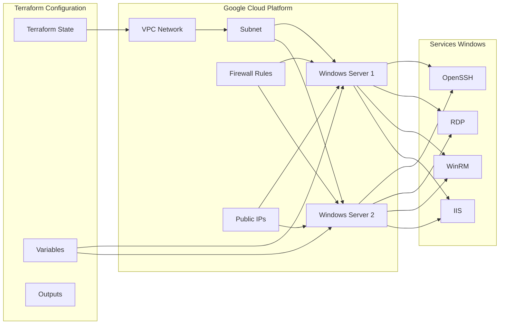
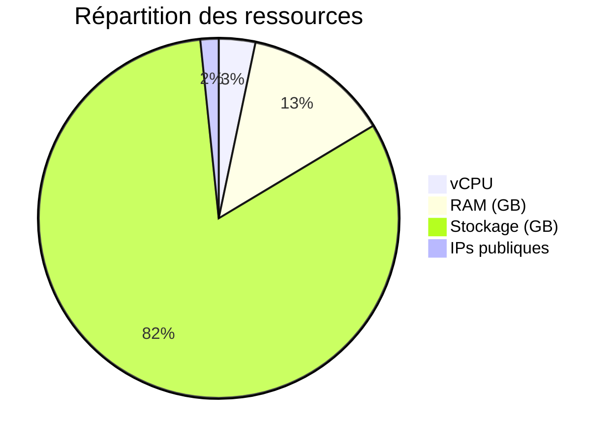
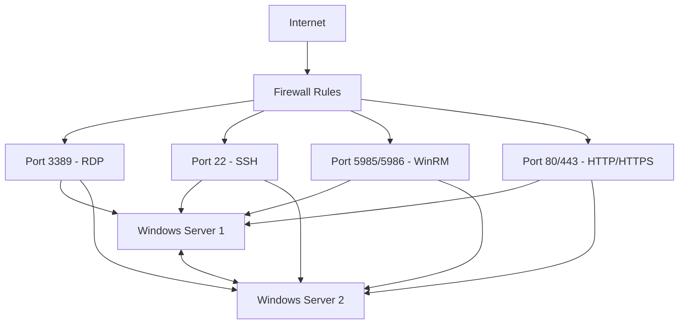
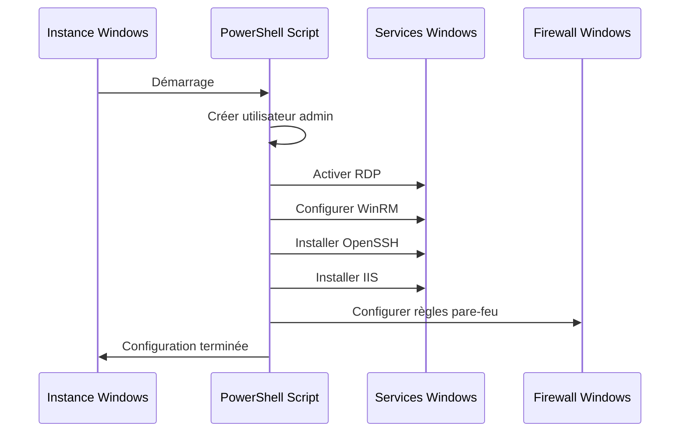
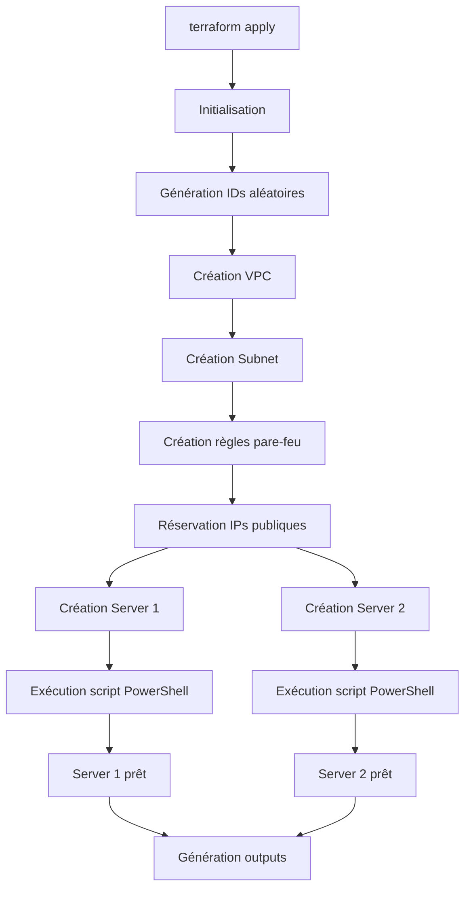
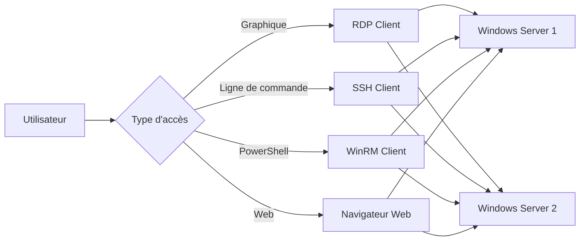

# Architecture détaillée

## 📋 Table des matières

- [Vue d'ensemble](#vue-densemble)
- [Composants réseau](#composants-réseau)
- [Instances de calcul](#instances-de-calcul)
- [Sécurité et pare-feu](#sécurité-et-pare-feu)
- [Scripts de configuration](#scripts-de-configuration)
- [Flux de données](#flux-de-données)

## Vue d'ensemble

L'infrastructure déployée par ce projet Terraform crée un environnement Windows Server isolé sur Google Cloud Platform avec les composants suivants :

### Composants principaux



## Composants réseau

### VPC et Subnet

| Composant | Configuration | Détails |
|-----------|---------------|---------|
| **VPC** | `vpc-windows-{random_id}` | Réseau privé isolé |
| **Subnet** | `subnet-windows-{random_id}` | Sous-réseau dans us-central1 |
| **CIDR** | `192.168.20.0/24` | 254 adresses IP disponibles |
| **Région** | `us-central1` | Région Google Cloud |

### Adressage IP

| Serveur | IP Privée | IP Publique | Usage |
|---------|-----------|-------------|-------|
| **Server 1** | `192.168.20.10` | Dynamique | Serveur principal |
| **Server 2** | `192.168.20.11` | Dynamique | Serveur secondaire |

## Instances de calcul

### Configuration des serveurs

| Paramètre | Valeur | Description |
|-----------|--------|-------------|
| **Image** | `windows-server-2025-dc-v20250913` | Windows Server 2025 Datacenter |
| **Machine Type** | `e2-standard-2` | 2 vCPU, 8GB RAM |
| **Disque** | `50GB SSD` | Disque de démarrage persistant |
| **Zone** | `us-central1-a` | Zone de disponibilité |

### Ressources allouées



## Sécurité et pare-feu

### Règles de pare-feu configurées

| Règle | Ports | Source | Cible | Description |
|-------|-------|--------|-------|-------------|
| **RDP** | `3389/tcp` | `0.0.0.0/0` | `windows-server` | Remote Desktop |
| **SSH** | `22/tcp` | `0.0.0.0/0` | `windows-server` | Secure Shell |
| **WinRM** | `5985,5986/tcp` | `0.0.0.0/0` | `windows-server` | Windows Remote Management |
| **Web** | `80,443/tcp` | `0.0.0.0/0` | `windows-server` | HTTP/HTTPS |
| **Internal** | `all` | `192.168.20.0/24` | `windows-server` | Communication interne |

### Flux de trafic



## Scripts de configuration

### Scripts PowerShell de démarrage

Chaque serveur exécute un script PowerShell au premier démarrage qui configure :

#### 1. Création d'utilisateur
```powershell
$username = "admin"
$password = "WinSrv{1|2}-{random_id.hex}"
net user $username $password /add
net localgroup administrators $username /add
```

#### 2. Configuration des services
- **RDP** : Activation du Remote Desktop
- **WinRM** : Configuration pour l'accès distant
- **OpenSSH** : Installation et configuration du serveur SSH
- **IIS** : Installation d'Internet Information Services

#### 3. Configuration de sécurité
- Désactivation de l'UAC pour WinRM
- Configuration du pare-feu Windows
- Génération des clés SSH

### Ordre d'exécution



## Flux de données

### Déploiement Terraform



### Accès aux serveurs



## Points d'attention

### Sécurité
- ⚠️ **Accès Internet ouvert** : Tous les ports sont accessibles depuis `0.0.0.0/0`
- ⚠️ **WinRM non chiffré** : Configuration `AllowUnencrypted="true"`
- ⚠️ **Mots de passe en clair** : Visibles dans les outputs Terraform

### Performance
- **Instances e2-standard-2** : Optimisées pour les charges de travail générales
- **Disques SSD** : Performances élevées pour les opérations I/O
- **Réseau** : Bande passante élevée entre les serveurs

### Disponibilité
- **Zone unique** : Déploiement dans `us-central1-a` uniquement
- **Pas de load balancer** : Aucune répartition de charge
- **Pas de sauvegarde automatique** : Snapshots manuels requis

## Évolutions possibles

### Haute disponibilité
- Déploiement multi-zone
- Load balancer pour la répartition de charge
- Sauvegardes automatiques

### Sécurité renforcée
- Bastion host pour l'accès
- VPN ou accès privé
- Chiffrement des communications

### Monitoring
- Stack de monitoring (Prometheus/Grafana)
- Logs centralisés
- Alertes automatiques
