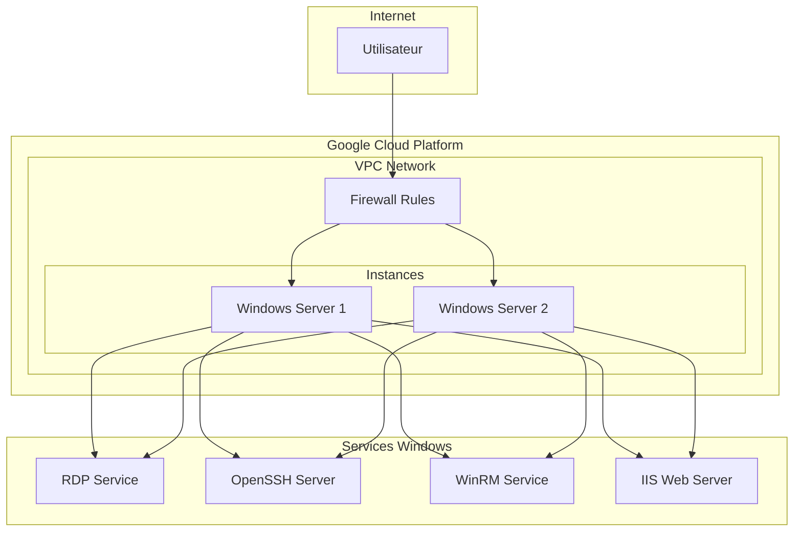
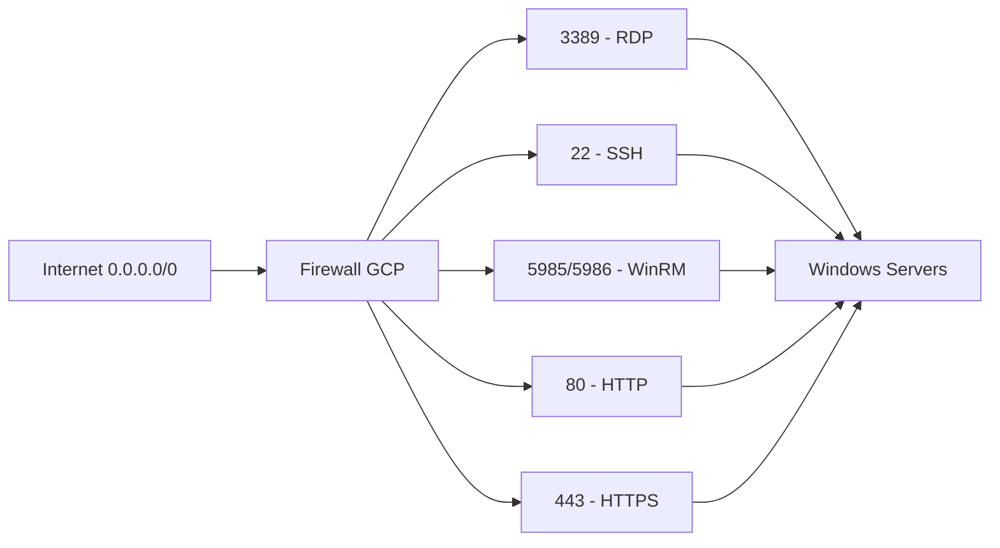

# Sécurité et accès

## 📋 Table des matières

- [Vue d'ensemble de la sécurité](#vue-densemble-de-la-sécurité)
- [Authentification](#authentification)
- [Accès réseau](#accès-réseau)
- [Configuration des services](#configuration-des-services)
- [Risques identifiés](#risques-identifiés)
- [Recommandations](#recommandations)
- [Bonnes pratiques](#bonnes-pratiques)

## Vue d'ensemble de la sécurité

Cette infrastructure déploie deux serveurs Windows Server 2025 avec plusieurs méthodes d'accès configurées. La sécurité est gérée à plusieurs niveaux : réseau, authentification et services.

### Architecture de sécurité



## Authentification

### Comptes utilisateurs

| Utilisateur | Mot de passe | Groupe | Privilèges |
|-------------|--------------|--------|------------|
| `admin` | `WinSrv{1\|2}-{random_id}` | `Administrators` | Administrateur complet |

### Méthodes d'authentification

#### 1. Authentification par mot de passe
- **Format** : `WinSrv1-{random_id.hex}` ou `WinSrv2-{random_id.hex}`
- **Exemple** : `WinSrv1-3e28`, `WinSrv2-3e28`
- **Stockage** : Visible dans les outputs Terraform

#### 2. Authentification SSH
- **Clés publiques** : Supportées
- **Mots de passe** : Activés
- **Utilisateurs autorisés** : `admin` et groupe `administrators`

#### 3. Authentification WinRM
- **Méthode** : Basic Authentication
- **Chiffrement** : Désactivé (`AllowUnencrypted="true"`)
- **UAC** : Désactivé pour WinRM

### Configuration des mots de passe

```powershell
# Script PowerShell de création d'utilisateur
$username = "admin"
$password = "WinSrv1-${random_id.network.hex}"

net user $username $password /add
net localgroup administrators $username /add
```

## Accès réseau

### Règles de pare-feu

| Service | Port | Protocole | Source | Cible | Risque |
|---------|------|-----------|--------|-------|--------|
| **RDP** | 3389 | TCP | `0.0.0.0/0` | `windows-server` | 🔴 Élevé |
| **SSH** | 22 | TCP | `0.0.0.0/0` | `windows-server` | 🔴 Élevé |
| **WinRM** | 5985/5986 | TCP | `0.0.0.0/0` | `windows-server` | 🔴 Critique |
| **HTTP** | 80 | TCP | `0.0.0.0/0` | `windows-server` | 🟡 Moyen |
| **HTTPS** | 443 | TCP | `0.0.0.0/0` | `windows-server` | 🟡 Moyen |
| **Interne** | All | All | `192.168.20.0/24` | `windows-server` | 🟢 Faible |

### Exposition Internet



### ⚠️ Risques d'exposition

- **Accès non restreint** : Tous les ports sont accessibles depuis Internet
- **Attaques par force brute** : Possibles sur tous les services
- **Scanning de ports** : Détection facile des services exposés
- **Trafic malveillant** : Pas de filtrage géographique

## Configuration des services

### Remote Desktop Protocol (RDP)

```powershell
# Configuration RDP
Set-ItemProperty -Path 'HKLM:\System\CurrentControlSet\Control\Terminal Server' -name "fDenyTSConnections" -value 0
Enable-NetFirewallRule -DisplayGroup "Remote Desktop"
```

**Sécurité** :
- ✅ Chiffrement intégré
- ⚠️ Accessible depuis Internet
- ⚠️ Pas de limitation de tentatives

### OpenSSH Server

```powershell
# Configuration SSH
$sshdConfig = @"
Port 22
AddressFamily any
ListenAddress 0.0.0.0
ListenAddress ::

PubkeyAuthentication yes
PasswordAuthentication yes
PermitEmptyPasswords no
PermitRootLogin no

AllowUsers admin
AllowGroups administrators
"@
```

**Sécurité** :
- ✅ Authentification par clés supportée
- ✅ Mots de passe vides interdits
- ⚠️ Authentification par mot de passe activée
- ⚠️ Accessible depuis Internet

### Windows Remote Management (WinRM)

```powershell
# Configuration WinRM
winrm quickconfig -q -force
winrm set winrm/config/service/auth '@{Basic="true"}'
winrm set winrm/config/service '@{AllowUnencrypted="true"}'

# Désactivation UAC pour WinRM
Set-ItemProperty -Path "HKLM:\SOFTWARE\Microsoft\Windows\CurrentVersion\Policies\System" -Name "LocalAccountTokenFilterPolicy" -Value 1
```

**Sécurité** :
- 🔴 **CRITIQUE** : Communications non chiffrées
- 🔴 **CRITIQUE** : UAC désactivé
- ⚠️ Authentification Basic (moins sécurisée)
- ⚠️ Accessible depuis Internet

### Internet Information Services (IIS)

```powershell
# Installation IIS
Install-WindowsFeature -Name Web-Server, Web-Mgmt-Tools, Web-WebServer, Web-Common-Http, Web-Default-Doc, Web-Dir-Browsing, Web-Http-Errors, Web-Static-Content, Web-Http-Logging, Web-Request-Monitor, Web-Http-Tracing, Web-Performance, Web-Stat-Compression, Web-Dyn-Compression, Web-Security, Web-Filtering, Web-Basic-Auth, Web-Client-Auth, Web-Digest-Auth, Web-Cert-Auth, Web-IP-Security, Web-Url-Auth, Web-Windows-Auth, Web-App-Dev, Web-Net-Ext45, Web-Asp-Net45, Web-ISAPI-Ext, Web-ISAPI-Filter, Web-WebSockets, Web-Mgmt-Console, Web-Mgmt-Compat, Web-Metabase, Web-Lgcy-Mgmt-Console, Web-Lgcy-Scripting, Web-WMI, Web-Scripting-Tools, Web-Mgmt-Service
```

**Sécurité** :
- ⚠️ Configuration par défaut
- ⚠️ Accessible depuis Internet
- ⚠️ Pas de certificat SSL configuré

## Risques identifiés

### 🔴 Critiques

1. **WinRM non chiffré**
   - **Impact** : Interception des communications
   - **Solution** : Désactiver `AllowUnencrypted="true"`

2. **UAC désactivé**
   - **Impact** : Élévation de privilèges facilitée
   - **Solution** : Réactiver UAC ou utiliser des comptes limités

3. **Accès Internet non restreint**
   - **Impact** : Attaques depuis n'importe où
   - **Solution** : Restreindre les sources IP

### 🟡 Élevés

1. **Mots de passe en clair**
   - **Impact** : Exposition dans les logs et outputs
   - **Solution** : Utiliser des secrets ou des clés SSH

2. **Authentification par mot de passe SSH**
   - **Impact** : Attaques par force brute
   - **Solution** : Désactiver l'authentification par mot de passe

3. **Pas de limitation de tentatives**
   - **Impact** : Attaques par force brute non limitées
   - **Solution** : Configurer fail2ban ou équivalent

### 🟢 Moyens

1. **Pas de monitoring**
   - **Impact** : Détection tardive des intrusions
   - **Solution** : Implémenter un système de monitoring

2. **Pas de sauvegardes automatiques**
   - **Impact** : Perte de données en cas d'incident
   - **Solution** : Configurer des snapshots automatiques

## Recommandations

### Immédiates (sans modification de code)

1. **Restreindre les sources IP**
   ```bash
   # Modifier les règles de pare-feu pour limiter l'accès
   # Remplacer 0.0.0.0/0 par vos IPs spécifiques
   ```

2. **Utiliser des clés SSH**
   ```bash
   # Générer une paire de clés
   ssh-keygen -t rsa -b 4096 -C "admin@windows-server"
   
   # Copier la clé publique sur le serveur
   ssh-copy-id admin@$(terraform output -raw server1_public_ip)
   ```

3. **Activer les logs de pare-feu**
   ```bash
   # Activer le logging sur les règles de pare-feu
   gcloud compute firewall-rules update allow-rdp-{id} --enable-logging
   ```

### À moyen terme

1. **Implémenter un bastion host**
   - Serveur de saut pour l'accès
   - Accès unique et contrôlé
   - Audit des connexions

2. **Configurer un VPN**
   - Accès privé aux serveurs
   - Chiffrement des communications
   - Authentification forte

3. **Mise en place du monitoring**
   - Détection d'intrusions
   - Alertes de sécurité
   - Logs centralisés

### Bonnes pratiques

1. **Principle of least privilege**
   - Accès minimal nécessaire
   - Comptes avec privilèges limités
   - Séparation des rôles

2. **Defense in depth**
   - Couches de sécurité multiples
   - Monitoring à tous les niveaux
   - Plan de réponse aux incidents

3. **Audit et conformité**
   - Traçabilité des accès
   - Logs d'audit
   - Conformité réglementaire

## Configuration sécurisée recommandée

### Règles de pare-feu restrictives

```hcl
# Exemple de règle restrictive
resource "google_compute_firewall" "allow_rdp_restricted" {
  name    = "allow-rdp-restricted"
  network = google_compute_network.windows_vpc.id

  allow {
    protocol = "tcp"
    ports    = ["3389"]
  }

  # Restreindre aux IPs spécifiques
  source_ranges = ["VOTRE_IP_PUBLIQUE/32"]
  target_tags   = ["windows-server"]
}
```

### Configuration SSH sécurisée

```bash
# Désactiver l'authentification par mot de passe
sudo sed -i 's/#PasswordAuthentication yes/PasswordAuthentication no/' /etc/ssh/sshd_config
sudo systemctl restart sshd
```

### Configuration WinRM sécurisée

```powershell
# Activer le chiffrement WinRM
winrm set winrm/config/service '@{AllowUnencrypted="false"}'
winrm set winrm/config/service/auth '@{Basic="false"}'
winrm set winrm/config/service/auth '@{Kerberos="true"}'
```

## Monitoring de sécurité

### Logs à surveiller

1. **Logs d'authentification**
   - Tentatives de connexion échouées
   - Connexions depuis des IPs suspectes
   - Élévation de privilèges

2. **Logs réseau**
   - Trafic suspect
   - Tentatives de scan de ports
   - Communications non autorisées

3. **Logs système**
   - Modifications de configuration
   - Installation de logiciels
   - Changements de permissions

### Alertes recommandées

- Plus de 5 tentatives de connexion échouées en 5 minutes
- Connexions depuis des pays non autorisés
- Modifications de fichiers système critiques
- Utilisation anormale des ressources

## Plan de réponse aux incidents

### En cas de compromission

1. **Isolation immédiate**
   - Déconnecter le serveur du réseau
   - Préserver les logs
   - Documenter l'incident

2. **Analyse forensique**
   - Examiner les logs
   - Identifier le vecteur d'attaque
   - Évaluer l'étendue des dégâts

3. **Récupération**
   - Restaurer depuis une sauvegarde propre
   - Appliquer les correctifs de sécurité
   - Renforcer la configuration

4. **Prévention**
   - Corriger les vulnérabilités identifiées
   - Améliorer le monitoring
   - Former les utilisateurs
